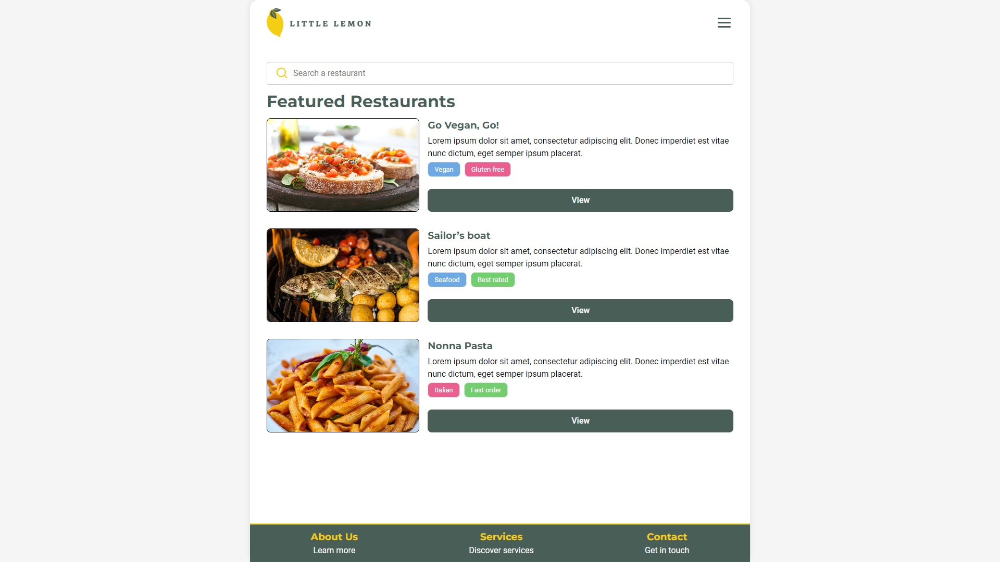

# Little lemon restaurant
This is a simple React project that uses Vite as a build tool. It is a simple restaurant website that allows users to view the menu and make reservations.



# Get Started
To run this React project with Vite, you need to have Node.js installed on your machine. You can download Node.js from [here](https://nodejs.org/en/).

```bash
npm install
npm run dev
```